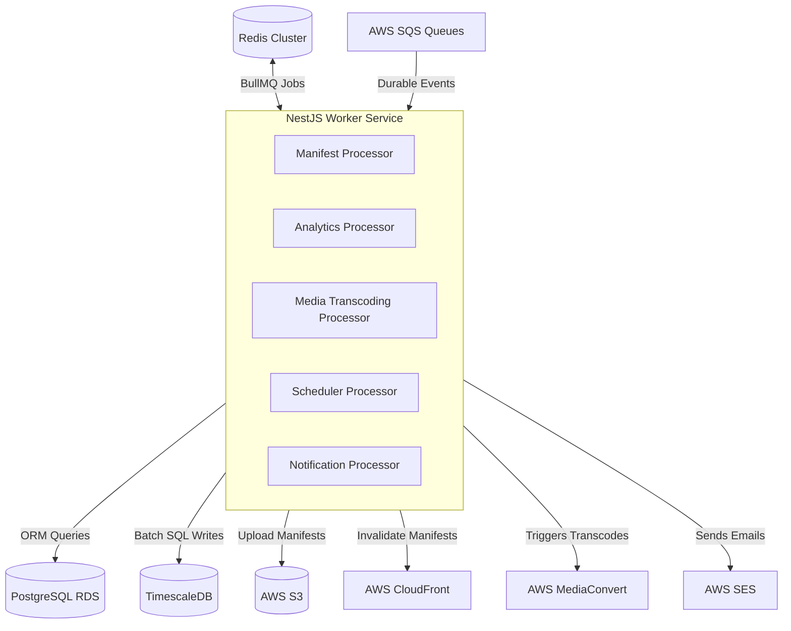
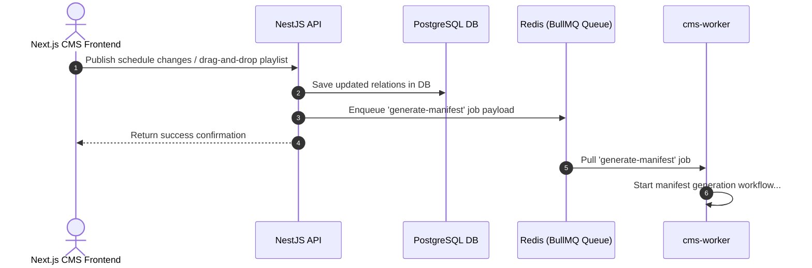
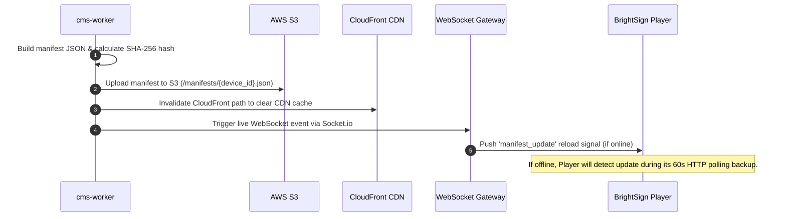
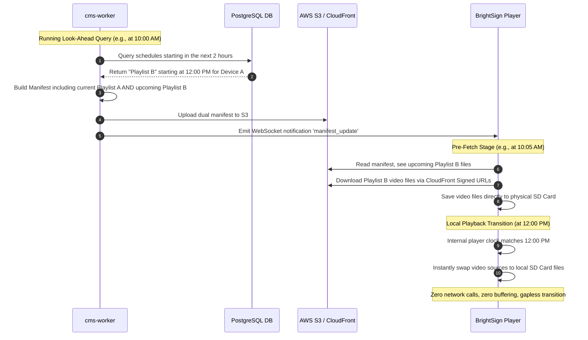

# Rubenius Background Worker Service (`cms-worker`)

The `cms-worker` is a headless, event-driven NestJS service responsible for executing all resource-intensive, asynchronous, and scheduled tasks in the Rubenius Digital Signage Platform. By offloading these workflows from the main client-facing APIs, the platform remains highly responsive even under heavy device loads.

---

## 1. System Architecture

The worker service sits in the background, continuously listening for events on **Redis BullMQ** and polling batch telemetry logs from **AWS SQS**.



---

## 2. Dynamic Communication Flow

The worker orchestrates data flow between the Next.js CMS frontend and the edge-based physical BrightSign players.

### Loop A: CMS $\rightarrow$ API $\rightarrow$ Worker
How a tenant's dashboard changes are sent to the background worker.



### Loop B: Worker $\rightarrow$ CloudFront $\rightarrow$ Media Player
How the worker publishes manifests and alerts the edge players.



---

## 3. Scheduled Content Logic (The "12:00 PM" Scenario)

To guarantee gapless transitions on screen, **the system never waits until the scheduled time to download media.** 

If a new playlist is scheduled to start at **12:00 PM**, the worker and player execute a look-ahead sequence hours in advance to pre-download the files directly onto the player's physical SD card.



### Flow Step Details:
1. **Look-Ahead Cron**: The worker runs a continuous 15-minute look-ahead cron. It queries Postgres for any playlist schedules starting within a 2-hour window.
2. **Dual-Playlist Manifest**: Instead of replacing the current manifest, the worker appends the upcoming playlists under the `schedule_rules` and lists all their media dependencies in the manifest's master `playlist` array.
3. **Pre-Staged Downloads**: When the player downloads the manifest, it compares the file checksums. It identifies files associated with the upcoming schedule and downloads them in the background while continuing to play the active loop.
4. **Offline Playback Trigger**: The player's internal scheduler runs locally. At exactly 12:00 PM, the local transition logic triggers: it stops playing the daytime attract loop and begins playing the newly cached video directly from the SD card.

---

## 4. Local SD Card Staging & Offline Cache

The media player operates in an **offline-first** environment. The storage on the physical SD card is strictly organized and managed by the player's runtime:

```
SD_CARD/
├── manifest.json            # Local copy of the downloaded manifest
├── pool/                    # Content storage pool
│   ├── sha256-a1b2c3d4...   # Media files renamed to their SHA-256 hashes
│   ├── sha256-e5f6g7h8...
│   └── sha256-i9j0k1l2...
└── logs/                    # Buffered telemetry files
    ├── play-logs.txt
    └── sensor-logs.txt
```

### Local Staging Logic:
*   **Hash-Based Deduplication**: Files are stored in the `/pool/` directory and named after their SHA-256 checksums rather than their original file names. If multiple playlists use the same video asset, it is only downloaded and saved once.
*   **Integrity Verification**: After downloading any file from the CDN, the player computes its SHA-256 hash. If it does not match the manifest checksum, the file is deleted and redownloaded.
*   **Cache Eviction (LRU/Pruning)**: The player checks its storage capacity before starting a pre-fetch download. If storage is above 85%, it scans the manifest's active media lists and deletes local files that are no longer referenced in either current or upcoming scheduled rules.

---

## 5. Directory Structure

```
cms-worker/
├── src/
│   ├── config/                 # Env validation and schema configs
│   │   ├── env.validation.ts
│   │   └── configuration.ts
│   ├── common/                 # Utilities, interceptors, and constants
│   ├── prisma/                 # Prisma client wrapper and module
│   ├── aws/                    # AWS SDK client wrappers (S3, SQS, SES, MediaConvert)
│   ├── jobs/                   # Types, interfaces, and job payload DTOs
│   ├── queues/                 # Redis BullMQ & SQS queue definitions
│   └── processors/             # Background job processors
│       ├── manifest.processor.ts
│       ├── analytics.processor.ts
│       ├── media.processor.ts
│       ├── scheduler.processor.ts
│       └── notification.processor.ts
├── prisma/
│   └── schema.prisma           # Shared PostgreSQL database schema
├── nest-cli.json
├── package.json
└── tsconfig.json
```

---

## 6. Job Payload Schemas

### Manifest Job Payload (Redis BullMQ)
Dispatched when a schedule changes or is manually forced.
```json
{
  "deviceId": "uuid-device-123",
  "tenantId": "uuid-tenant-999",
  "reason": "schedule_changed"
}
```

### Telemetry Batch Ingestion Payload (AWS SQS)
Batched by the device and written to SQS for asynchronous writing.
```json
{
  "deviceId": "uuid-device-123",
  "tenantId": "uuid-tenant-999",
  "batchTimestamp": 1721034000,
  "proofOfPlay": [
    {
      "mediaId": "uuid-media-abc",
      "playlistId": "uuid-playlist-daytime",
      "duration": 30,
      "playedFully": true,
      "time": "2026-07-15T14:40:00Z"
    }
  ],
  "sensorEvents": [
    {
      "sensorType": "pir",
      "payload": { "detected": true },
      "triggeredRuleId": "rule-pir-promo",
      "time": "2026-07-15T14:41:10Z"
    }
  ]
}
```

---

## 7. Local Setup & Execution

### Prerequisites
*   Node.js 18+ & npm
*   Running Redis instance (for BullMQ)
*   Access to the PostgreSQL database

### Installation
```bash
# Install dependencies
$ npm install

# Generate Prisma Client
$ npx prisma generate
```

### Run the Worker
```bash
# Development mode
$ npm run start

# Watch mode (automatically recompile on changes)
$ npm run start:dev

# Production mode
$ npm run start:prod
```
