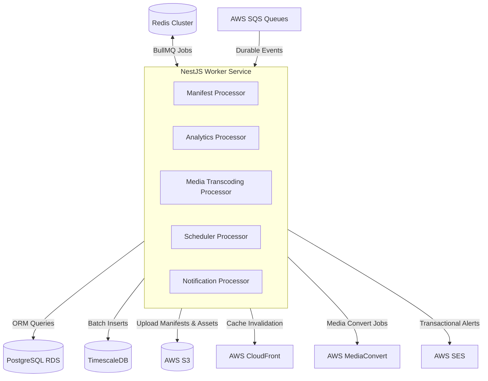

# Rubenius — Background Worker Service
## Master Architecture & Implementation Plan (v1.0)

This document outlines the architecture, design choices, data flow, directory structure, and phased implementation roadmap for the **Rubenius Background Worker Service** (`cms-worker`). 

The worker is a NestJS service designed to run in a headless environment (no UI, no React, no API routes). It is responsible for handling all resource-intensive, asynchronous, and scheduled tasks for the Rubenius Digital Signage Platform.

---

## 1. Role in the System Architecture

The worker service sits behind the client-facing APIs, consuming jobs from **Redis (BullMQ)** and **AWS SQS**, and writing data directly to **PostgreSQL RDS**, **TimescaleDB**, and **AWS S3**.



---

## 2. Directory Structure

The worker service project is organized as a modular NestJS application. It shares the same TypeScript models, database schemas, and configuration patterns as the main API, but runs only queue listeners and cron runners.

```
cms-worker/
├── src/
│   ├── config/                 # Env validation and variables
│   │   ├── env.validation.ts
│   │   └── configuration.ts
│   ├── common/                 # Shared utilities, filters, decorators
│   ├── prisma/                 # Prisma Module & Client Service
│   ├── aws/                    # AWS SDK Module (S3, SQS, SES, MediaConvert)
│   ├── jobs/                   # Shared DTOs and Type Definitions for Jobs
│   ├── queues/                 # BullMQ & SQS Queue Definition Modules
│   ├── processors/             # Concrete Job Consumers (Processors)
│   │   ├── manifest.processor.ts
│   │   ├── analytics.processor.ts
│   │   ├── media.processor.ts
│   │   ├── scheduler.processor.ts
│   │   └── notification.processor.ts
│   ├── app.module.ts           # Imports all queues and database modules
│   └── main.ts                 # Headless bootstrap configuration
├── prisma/
│   └── schema.prisma           # Shared schema definition
├── tsconfig.json
└── package.json
```

---

## 3. Dedicated Queues & Processors

The worker operates on two distinct queue types: **Redis BullMQ** (for fast, time-locked, or scheduled workflows) and **AWS SQS** (for durable, high-volume telemetry ingestion).

### Queue Setup Matrix

| Queue Name | Backend | Ingestion Rate | Processor Class | Primary Purpose |
| :--- | :--- | :--- | :--- | :--- |
| `manifest-queue` | Redis (BullMQ) | Medium (On-demand) | `ManifestProcessor` | Builds, hashes, and uploads device manifests. |
| `media-queue` | Redis (BullMQ) | Low (On upload) | `MediaProcessor` | Orchestrates video transcoding & thumbnailing. |
| `telemetry-queue` | AWS SQS | High (Continuous) | `AnalyticsProcessor` | Batches proof-of-play & sensor logs to TimescaleDB. |
| `scheduler-queue` | Redis (BullMQ) | Low (Cron/Time-locked) | `SchedulerProcessor` | Executes calendar logic and daily cron cleanups. |
| `notification-queue` | AWS SQS | Medium (Continuous) | `NotificationProcessor` | Sends transactional emails, Slack alerts, and webhooks. |

---

## 4. Key Job Workflows & Implementation Details

### A. Manifest Generator (`ManifestProcessor`)
When a playlist is updated or a schedule changes, the API server dispatches a `generate-manifest` job to `manifest-queue`.
1.  **Read Database**: Fetch the device's assigned playlists, target schedule rules, and local sensor configurations.
2.  **Generate JSON**: Structure the manifest JSON containing media URLs, schedules, and edge sensor rules.
3.  **Hash Manifest**: Generate a SHA-256 hash (`manifest_hash`) of the JSON payload.
4.  **S3 Upload**: Write the manifest directly to AWS S3: `/manifests/{device_id}.json`.
5.  **Invalidation**: Trigger an AWS CloudFront cache invalidation request for `/manifests/{device_id}.json` to force edge players to download the fresh config.
6.  **WebSocket Notification**: Push a lightweight reload trigger to the device via Socket.io if currently online.

### B. Telemetry Batch Writer (`AnalyticsProcessor`)
BrightSign players batch telemetry and upload logs every 5 minutes. The API writes these batches straight to SQS. The worker pulls them to save database connections.
1.  **SQS Polling**: Continuously poll `telemetry-queue` for batch payloads.
2.  **Validation**: Verify structure (Proof-of-play records and Sensor trigger logs).
3.  **TimescaleDB Batch Write**: Execute raw `INSERT` queries using PostgreSQL COPY or batch `INSERT INTO ... VALUES` into TimescaleDB hypertables.
4.  **Deduplication**: Use content hashes and client timestamps to prevent double-inserting duplicate logs.

### C. Media Transcoder (`MediaProcessor`)
Handles assets uploaded by tenants to ensure they match BrightSign codecs.
1.  **Option A (AWS MediaConvert)**: Create and monitor an AWS Elemental MediaConvert job to output compatible H.264 MP4 variants.
2.  **Option B (Serverless FFmpeg)**: Trigger a Lambda function running FFmpeg for quick transcoding and thumbnail extraction, then update the Prisma record state to `READY`.

### D. System Cleanup & Scheduler (`SchedulerProcessor`)
A time-locked queue that executes routine maintenance:
1.  **Telemetry Aggregation**: Trigger TimescaleDB continuous aggregate refreshes (hourly/daily rollups).
2.  **TTL Cleanup**: Remove heartbeats older than 90 seconds from Redis, and purge raw logs exceeding the tenant plan limits.
3.  **Media Pruning**: Identify assets deleted from the database and remove their corresponding files from S3.

---

## 5. Job JSON Schemas

### Manifest Generation Job
```json
{
  "job": "generate-manifest",
  "data": {
    "tenantId": "uuid-tenant-999",
    "deviceId": "uuid-device-123",
    "reason": "schedule_changed"
  }
}
```

### Telemetry Batch Ingestion (SQS Message)
```json
{
  "deviceId": "uuid-device-123",
  "tenantId": "uuid-tenant-999",
  "batchTimestamp": 1721034000,
  "proofOfPlay": [
    {
      "mediaId": "uuid-media-abc",
      "playlistId": "uuid-playlist-daytime",
      "duration": 30,
      "playedFully": true,
      "time": "2026-07-15T14:40:00Z"
    }
  ],
  "sensorEvents": [
    {
      "sensorType": "pir",
      "payload": { "detected": true },
      "triggeredRuleId": "rule-pir-promo",
      "time": "2026-07-15T14:41:10Z"
    }
  ]
}
```

---

## 6. Error Handling & Resiliency

Because the worker processes critical, high-volume tasks, it must recover from failure gracefully:

*   **Exponential Backoff Retries**: BullMQ and SQS are configured to retry failed jobs up to 5 times.
    $$\text{Delay} = \text{Initial Delay} \times 2^{\text{attempt}}$$
*   **Dead Letter Queues (DLQ)**: SQS messages that fail 5 times are routed to `telemetry-dlq`. Alerts are pushed to Slack, and administrators can manually review and purge the queue.
*   **Database Transaction Isolation**: Prisma connection pools are set with short request timeouts, preventing a slow RDS instance from locking up the worker process.
*   **Idempotency**: All jobs must be idempotent. If a manifest generation job is executed twice, it generates the exact same output file without causing database side-effects.

---

## 7. 6-Week Implementation Plan

A modular, testable roadmap to build the worker service from scratch:

```mermaid
gantt
    title Worker Service Build Roadmap
    dateFormat  W
    axisFormat  W%W
    
    section Setup & Scaffold
    W1: Scaffolding, Prisma, Redis, SQS Config     :active, w1, 1w
    
    section Core Workflows
    W2: Manifest Builder, S3 Sync & CDN Invalidate  : w2, 1w
    W3: Media Convert Integration & FFmpeg Lambda   : w3, 1w
    
    section Data Pipeline
    W4: Telemetry Consumer & TimescaleDB Ingest    : w4, 1w
    
    section Automation
    W5: Scheduler Crons & System Cleanups          : w5, 1w
    
    section Hardening
    W6: Retries, DLQ, Alerts, Load Testing         : w6, 1w
```

### Week-by-Week Roadmap

*   **Week 1: Setup & Scaffolding**
    *   Initialize NestJS worker configuration.
    *   Configure Prisma module and import target schemas.
    *   Build SQS and Redis BullMQ client wrappers.
    *   Set up environment configurations and health indicators.
*   **Week 2: Manifest Generation Engine**
    *   Implement `manifest.processor.ts` to output device manifest structures.
    *   Write files to S3 and verify signed URLs.
    *   Integrate CloudFront Cache Invalidation SDK requests.
*   **Week 3: Media Processing**
    *   Integrate FFmpeg thumbnail generation logic.
    *   Configure AWS Elemental MediaConvert job templates.
    *   Build fallback encoders for image formats.
*   **Week 4: Telemetry Ingestion Pipeline**
    *   Implement SQS consumer for telemetry events.
    *   Write SQL copy scripts to batch insert logs into TimescaleDB hypertables.
    *   Write tests validating no data loss under simulated queue delays.
*   **Week 5: Schedulers & Cleanups**
    *   Implement system maintenance cron schedulers.
    *   Write automated TimescaleDB aggregation triggers.
    *   Build media sync processes to cleanup orphaned S3 files.
*   **Week 6: Production Hardening**
    *   Write retry policies and link Dead Letter Queues (DLQ).
    *   Hook up Sentry logging for processor errors.
    *   Run stress tests simulating 10,000 parallel device heartbeats.
