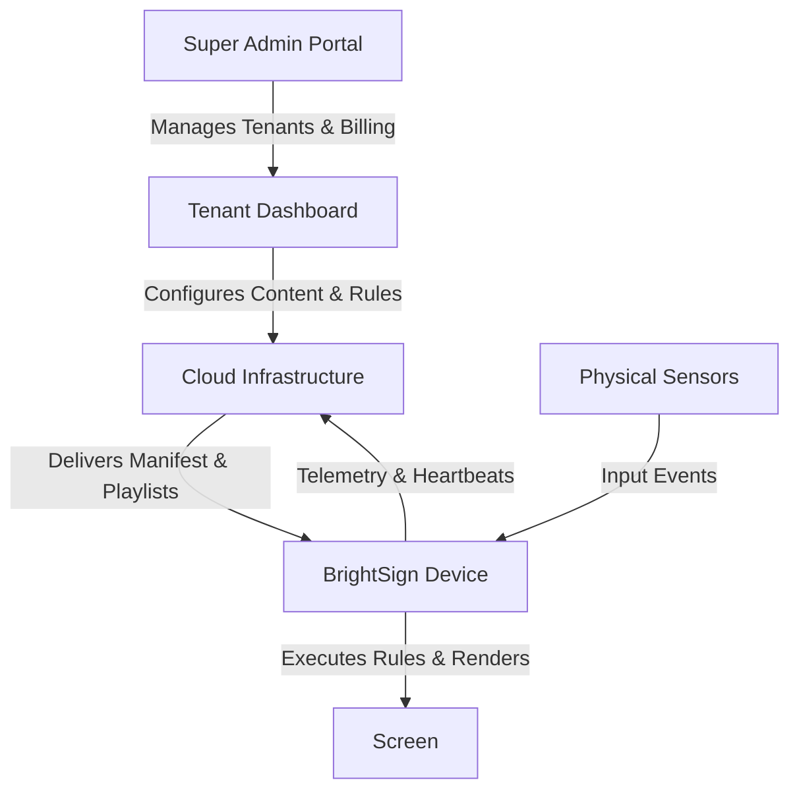
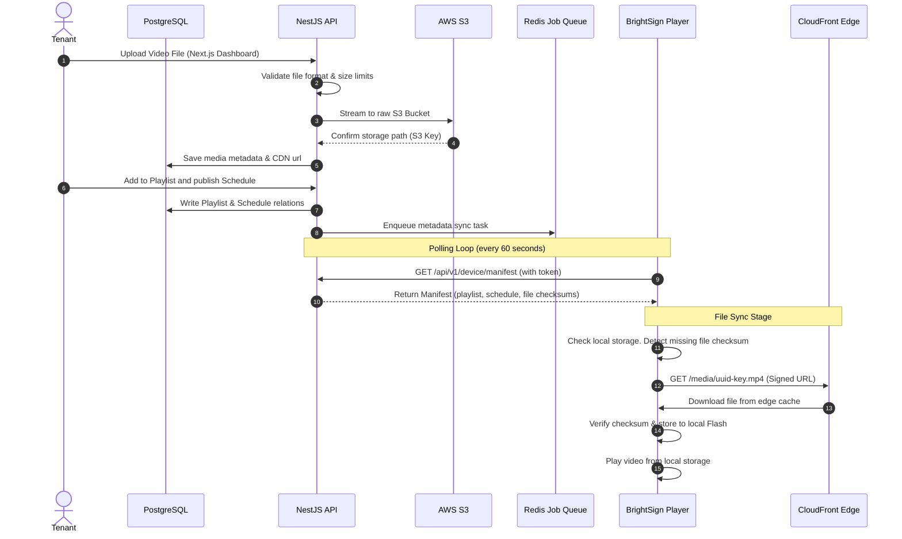
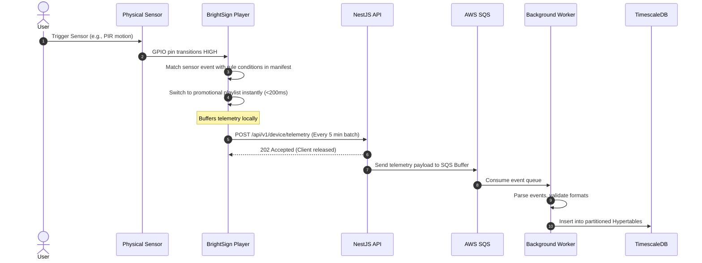
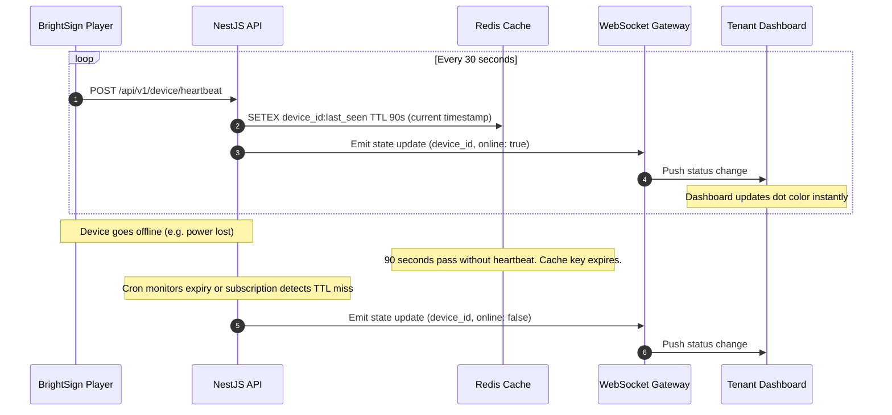
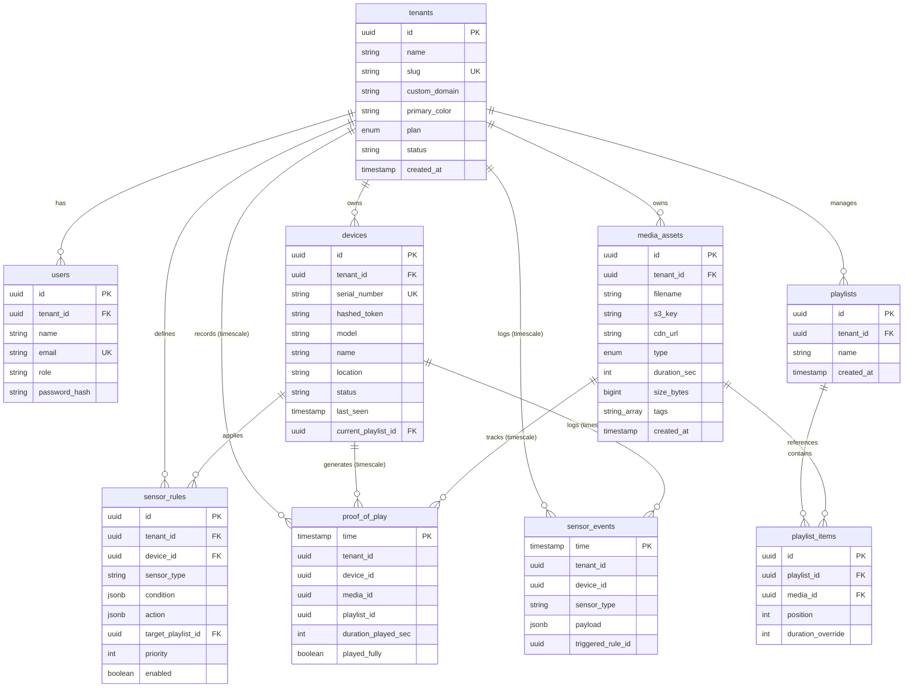

# Rubenius — Digital Signage Platform
## Master Architecture & Implementation Plan (v2.0)

Rubenius is a white-label, multi-tenant Software-as-a-Service (SaaS) platform for digital signage powered by BrightSign hardware. Businesses (tenants) upload media, build playlists, configure sensor-driven content rules, and deploy them to thousands of screens worldwide through a single dashboard. 

This document serves as the comprehensive technical reference for the platform's architecture, hardware integrations, database design, user interfaces, data flows, and phased implementation schedule.

---

## 1. Platform Overview

The platform is designed around three main user-facing and hardware-facing pillars:



*   **Super Admin Portal**: Owned and operated by Rubenius. Used to monitor all tenants, configure global subscription billing plans, manage platform settings, track key business metrics (MRR, ARR, churn), and impersonate tenant workspaces for support.
*   **Tenant Dashboard**: A fully white-labeled interface (via custom domains and tenant-specific CSS themes) where individual businesses manage their media libraries, assemble drag-and-drop playlists, register and group screens, build sensor rules, and analyze screen play analytics.
*   **Media Player App**: A lightweight, robust Javascript/HTML5 application running locally on BrightSign edge hardware. It polls for manifest configurations, caches media locally via CDN, executes sensor rules at the edge with <200ms latency, and buffers playback telemetry to report back asynchronously.

---

## 2. Technology Stack

Every layer of the Rubenius stack has been chosen to optimize scalability, type safety, offline durability, and performance under massive device loads.

| Layer | Technology | Purpose | Key Rationale |
| :--- | :--- | :--- | :--- |
| **Frontend — Admin** | Next.js 14 (App Router) | Super Admin SPA | Native SSR, speed, React Server Components. |
| **Frontend — Tenant** | Next.js 14 + Tailwind CSS | Tenant Dashboard UI | Robust custom domain routing, responsive CSS variables. |
| **State Management** | React Query (TanStack) | Client/Server State Cache | Background refetching, caching, WS synchronization. |
| **Backend API** | NestJS (Node.js) | REST + WebSocket API | Modular architecture, TypeScript-first dependency injection. |
| **ORM** | Prisma | Data Access Layer | Type safety, clean migrations, multi-tenant context injection. |
| **Primary Database** | PostgreSQL (AWS RDS) | Relational Core Data | ACID compliance, JSONB queries, row-level security. |
| **Time-Series DB** | TimescaleDB | Telemetry & Analytics | Sub-millisecond queries, hypertable partitioning, daily rollups. |
| **Cache & Queue** | Redis (AWS ElastiCache) | Session caching + BullMQ | Fast key-value access, job queue backend, pub/sub gateway. |
| **Message Ingestion** | AWS SQS | Telemetry buffering | Decouples high-frequency writes from backend processing. |
| **Asset Storage** | AWS S3 (ap-south-1) | Raw Media Files | High durability, lifecycle policies, presigned upload URLs. |
| **CDN** | AWS CloudFront | Edge Media Distribution | Caching media at edge locations, signed URLs (24h expiry). |
| **Real-Time Gateway** | Socket.io (WebSocket) | Live dashboard alerts | Tenant-scoped rooms, device live connectivity states. |
| **Authentication** | JWT + Refresh Tokens | Secure User & Device Access | Stateless user auth, dedicated hashed device tokens. |
| **Media Transcoder** | FFmpeg on AWS Lambda | Media processing on upload | Serverless transcoding to BrightSign-compatible H.264 MP4. |
| **Billing & Payments** | Razorpay Subscriptions | Recurring SaaS plans | Subscription lifecycle webhooks, India-first local compliance. |
| **Notification Engine** | AWS SES | Transactional alerts | Cost-effective transactional emails, system alerts. |

---

## 3. BrightSign Hardware Profile

BrightSign players are the industry standard for commercial digital signage. They run the custom **BrightSign OS** and support edge-based hardware interactions:

*   **LS Series (Lite — LS424/LS425)**: Entry-level players. Supports Full HD 1080p single video rendering and basic GPIO triggers. Ideal for simple menu boards or static digital retail panels.
*   **XD Series (Extended — XD1035/XD1235)**: Mid-range workhorse. Capable of dual video decoding, full 4K output, and supports GPIO, USB, and Serial sensor accessories. The standard choice for retail deployments.
*   **XT Series (High-End — XT1143/XT1144)**: Premium players. Features dual-decode 4K HDR playback, live data widgets, UDP synchronization, and intensive interactive HTML5 engines. Ideal for retail malls and interactive touch kiosks.
*   **XC Series (Enterprise — XC2055/XC4055)**: Ultra-powerful multi-output 8K engines. Designed for advanced multi-screen video walls, airports, and large venues. Supports full sensor stacks and HDMI-CEC CEC screen control.

> [!NOTE]
> **Integration Model**: The Rubenius Player App runs locally as an HTML5 bundle, utilizing native BrightSign JavaScript and BrightScript objects (such as `roControlPort`, `roUrlTransfer`, and `roNetworkAdvertisement`) to interact directly with edge sensors and local system storage.

---

## 4. Supported Sensors & Event Schema

To provide context-aware edge content switching, BrightSign hardware connects to various sensor classes. Each sensor writes structured events to the local runtime:

### Sensor Catalog

*   **PIR Motion Sensor (GPIO)**: Detects motion within a 5-10m radius.
    ```json
    { "type": "motion", "detected": true, "ts": 1721033624000 }
    ```
*   **Ultrasonic Proximity (Serial RS-232)**: Measures precise viewer distance in centimeters.
    ```json
    { "type": "distance", "cm": 45, "ts": 1721033624500 }
    ```
*   **Temperature & Humidity (DHT22 - Serial)**: Gathers local temperature (°C) and relative humidity (%).
    ```json
    { "type": "temp", "celsius": 28.4, "humidity": 62, "ts": 1721033625000 }
    ```
*   **Ambient Light (GPIO)**: Measures light exposure in lux to adjust display brightness or target daytime/nighttime variations.
    ```json
    { "type": "light", "lux": 820, "ts": 1721033626000 }
    ```
*   **Physical Push Button (GPIO)**: Detects rising/falling edge state changes from button panels.
    ```json
    { "type": "button", "pin": 3, "state": "pressed", "ts": 1721033627000 }
    ```
*   **QR / Barcode Scanner (USB Serial)**: Scans printed/digital codes for interactive loyalty programs.
    ```json
    { "type": "scan", "code": "9780201379624", "ts": 1721033628000 }
    ```
*   **RFID / NFC Reader (USB/Serial)**: Identifies near-field tag UIDs to load personalized content profiles.
    ```json
    { "type": "nfc", "uid": "A3F09C", "ts": 1721033629000 }
    ```
*   **Audio Decibel Sensor (GPIO)**: Measures noise thresholds to trigger visual overrides in loud spaces.
    ```json
    { "type": "sound", "db": 72, "ts": 1721033630000 }
    ```
*   **GPS Module (Serial)**: Captures location data (lat/lng) for screens installed on buses, vehicles, or moving transit kiosks.
    ```json
    { "type": "gps", "lat": 19.0760, "lng": 72.8777, "ts": 1721033631000 }
    ```
*   **HDMI-CEC (Display Connection)**: Controls screen power, input source, and audio outputs.
    ```json
    { "type": "cec", "cmd": "power_on", "display": 1, "ts": 1721033632000 }
    ```

---

## 5. System Data Flows

### Flow 1: Content Upload & Delivery (Cloud to Device)

How a video asset goes from a tenant's dashboard to playing locally on a screen.



---

### Flow 2: Sensor Event Pipeline (Device to Cloud)

How a physical sensor event triggers an edge content switch and updates cloud analytics.



---

### Flow 3: Real-Time Heartbeat Connectivity

How the tenant dashboard maintains a live view of online and offline devices.



---

## 6. Database Relational Schema



---

## 7. System Architecture Layers

The Rubenius platform is split cleanly into isolated tiers:

1.  **Edge Layer (BrightSign Device)**: Executes core business logic offline. Evaluates sensor triggers via a local rule evaluator in <200ms. Reads media from local flash card caches to ensure screens never go blank.
2.  **CDN Routing Layer (CloudFront)**: Serves cached content assets from global edge endpoints (prioritizing ap-south-1 regions). Enforces security through signed resource tokens.
3.  **Client Web App Layer (Next.js 14)**: Houses the multi-tenant client interfaces. White-label parameters (domains, fonts, colors) are resolved server-side.
4.  **API Gateway Layer (NestJS Core)**: Validates incoming payloads, manages tenant isolation contexts, maps JWT request subjects, and regulates endpoint request throttling.
5.  **Service Business Layer (NestJS Services)**: Evaluates complex background processes, orchestrates transcoding worker states, coordinates calendared playlist schedulers, and manages the billing gateways.
6.  **Asynchronous Job Queues (BullMQ & SQS)**:
    *   **Redis BullMQ**: Processes time-locked content pushes.
    *   **AWS SQS**: Manages durable log ingestions (Proof-of-play batches) and email distribution jobs.
7.  **Data Storage Layer (Relational + Time-Series)**:
    *   **PostgreSQL**: Keeps clean relational state models (Users, Settings, Devices, Playlists).
    *   **TimescaleDB**: Optimizes millions of timeseries telemetry logs using hypertable storage chunks.

---

## 8. Dashboard Feature Matrices

### Super Admin Portal (Platform Operator UI)
*   **Tenant Administration**: Register, suspend, and delete tenants. Configure domain bindings and brand assets. Impersonate workspaces for debugging.
*   **Billing & Subscriptions**: Track Platform MRR/ARR, monitor Razorpay invoices, manage upgrades/downgrades, and apply discount structures.
*   **Observability**: Track total active devices globally, calculate global edge request frequencies, monitor S3 bucket storage sizes, and view real-time system performance logs.

### Tenant Dashboard (Customer Portal UI)
*   **Media Management**: Drag-and-drop file uploader, media transcoding indicator (transcoding, ready), tagging, and custom folders.
*   **Playlist Builder**: Assemble slide ordering, set fallback playlists, toggle transitions, and customize per-slide runtime durations.
*   **Scheduler Calendar**: Interactive layout showing published playlist cycles, timezone offset targets, and priority overrides.
*   **Device Registry**: Connect serial numbers, group screens into floor/location zones, view currently playing assets, and execute remote resets.
*   **Rule Builder**: Create sensor actions: `IF [sensor_type] [condition] THEN [switch_playlist]`.
*   **Analytics**: View proof-of-play reports, track screen uptime metrics, and export analytics (CSV, PDF) for advertisers.

---

## 9. On-Device Media Player Manifest

Below is the structure of the JSON manifest fetched by BrightSign devices every 60 seconds to align its state with the tenant's configuration:

```json
{
  "device_id": "uuid-device-1234-5678",
  "manifest_hash": "sha256-a1c2e3f4g5...",
  "published_at": "2026-07-15T14:35:00Z",
  "playlist": [
    {
      "media_id": "uuid-m1",
      "cdn_url": "https://cdn.rubenius.com/tenants/t1/media/video1.mp4",
      "duration_sec": 30,
      "checksum": "sha256-f5b2e1..."
    },
    {
      "media_id": "uuid-m2",
      "cdn_url": "https://cdn.rubenius.com/tenants/t1/media/image2.png",
      "duration_sec": 10,
      "checksum": "sha256-e9c8a1..."
    }
  ],
  "schedule_rules": [
    {
      "days": ["mon", "tue", "wed", "thu", "fri"],
      "start": "09:00",
      "end": "18:00",
      "playlist_id": "uuid-playlist-daytime"
    }
  ],
  "sensor_rules": [
    {
      "id": "rule-pir-promo",
      "sensor": "pir",
      "condition": {
        "detected": true
      },
      "action": {
        "switch_playlist": "uuid-playlist-promo"
      },
      "priority": 1,
      "timeout_sec": 30
    }
  ]
}
```

---

## 10. Tenant Pricing & Feature Matrix

The platform is structured into four functional tiers based on screen volume and analytics depth:

| Feature | Starter (₹1,999/mo) | Growth (₹4,999/mo) | Business (₹12,999/mo) | Enterprise (Custom) |
| :--- | :--- | :--- | :--- | :--- |
| **Max Connected Screens** | Up to 5 | Up to 25 | Up to 100 | Unlimited |
| **Cloud Storage** | 10 GB | 50 GB | 250 GB | Custom Allocation |
| **Seats** | 2 | 5 | 20 | Unlimited |
| **Media Scheduling** | Included | Included | Included | Included |
| **Active Sensor Rules** | Max 2 | Max 10 | Unlimited | Unlimited |
| **Data Retention** | 30 Days | 90 Days | 365 Days | Unlimited |
| **White-Label Theme** | — | Colors & Logos | Full Domain Bind | Custom Domain + Email |
| **API Endpoints** | — | Read-only | Full Write | Full + Custom Webhooks |
| **Reporting Formats** | Online charts | CSV Export | CSV + PDF | CSV + PDF + Analytics Sync |
| **Support SLA** | Standard Email | Priority Chat | 24-hour SLA | Dedicated CSM |

---

## 11. Sensor Interaction Scenarios

Below are step-by-step walkthroughs of how physical sensor events trigger local content updates and sync with the cloud.

### Scenario A: PIR Motion Sensor (Attract Loop to Engagement Content)
1.  **Trigger**: A customer walks within 3 meters of a display kiosk. The PIR sensor transitions its GPIO pin to HIGH. The device's local runtime captures an `InputChange` event.
2.  **Edge Evaluation**: The local rule engine processes the event. It verifies the current time fits the 09:00-18:00 window and that no higher-priority rule is running.
3.  **Visual Transition**: The screen crossfades from a looping ambient screen to a promotional product video in <200ms. Since the video is pre-downloaded, there is zero network latency.
4.  **Logging**: The player app logs the event to its local buffer. The event is scheduled to be uploaded to the cloud in the next 5-minute batch.
5.  **Timeout**: After 30 seconds of no motion detected, the countdown expires and the screen fades back to the ambient loop.

### Scenario B: Temperature Sensor (Contextual Advertising)
1.  **Trigger**: An outdoor serial temperature probe reads ambient air temperature every 60 seconds.
2.  **Rolling Average**: The player runtime calculates a rolling average of the last 5 readings to prevent flickering from minor temperature changes.
3.  **Hysteresis & Thresholds**: The threshold to show hot beverages is set to 18°C. Hysteresis parameters specify that it must warm back up to 20°C before returning to default media. If the average drops below 18°C, the rule triggers.
4.  **Content Transition**: The screen changes to advertise hot coffee options.
5.  **Analytics Correlation**: Uptime temperatures are recorded alongside active playlist references in TimescaleDB, allowing the tenant to compare ROI between hot drink ads and local temperatures.

### Scenario C: Staff Call Button (GPIO to Live Dashboard)
1.  **Trigger**: A customer presses a physical "Request Assistance" button. The GPIO pin transitions to HIGH.
2.  **Debounce**: The device applies a 50ms software debounce to avoid registering false button double-presses.
3.  **Relay Action**: The device triggers a local relay to sound a buzzer in the back office, while updating the screen to display a confirmation message.
4.  **Real-Time API Call**: Unlike background play logs, this alert is sent to the cloud immediately: `POST /api/v1/device/alert`.
5.  **WebSocket Push**: The NestJS gateway receives the alert and pushes it to the tenant dashboard, displaying a flashing notification on the manager's screen in under 100ms.
6.  **Staff Response**: A staff member resolves the alert in the dashboard. This logs the employee response time and clears the alert notification on the physical kiosk.

---

## 12. Scalability Tiers

Rubenius is architected to scale from startup workloads to massive enterprise fleets without requiring a rewrite:

### Stage 1: Launch (10 - 500 Screens)
*   **Infrastructure**: Single NestJS container running on AWS ECS, a Postgres database (AWS RDS t3.medium), and Redis (AWS ElastiCache) for caching and BullMQ.
*   **System Load**: 500 screens polling every 60 seconds generates only ~8.3 requests/sec. The system easily handles this load.
*   **Operational Cost**: ~$200 – $400/month.

### Stage 2: Growth (500 - 5,000 Screens)
*   **Infrastructure**: NestJS containers scale horizontally (2 to 5 tasks). Read replicas are added to the RDS cluster to handle heavy dashboard read traffic. TimescaleDB is moved to a dedicated instance.
*   **Telemetry Handling**: High-frequency writes are offloaded to SQS queues to decouple database inserts from the API server.
*   **Operational Cost**: ~$600 – $1,200/month.

### Stage 3: Scale (5,000 - 50,000 Screens)
*   **Infrastructure**: The monolith is split into core microservices: Frontend APIs, Device Ingestion, Billing, and Analytics. Heartbeat processing endpoints are isolated onto dedicated autoscale groups.
*   **DB Optimization**: Prisma requests pass through a PgBouncer connection pool. TimescaleDB continuous aggregates pre-calculate daily reports.
*   **Operational Cost**: ~$3,000 – $6,000/month.

### Stage 4: Enterprise (50,000+ Screens)
*   **Infrastructure**: Services deploy via AWS EKS. Inter-service events run over Apache Kafka. Write processes route to Aurora PostgreSQL Serverless nodes.
*   **Isolation**: Large enterprise clients get dedicated, isolated database shards to prevent multi-tenant cross-talk.
*   **Operational Cost**: $15,000+/month.

---

## 13. Phased Implementation Roadmap

This 12-week development plan focuses on delivering testable vertical slices, ensuring the codebase is always in a deployable state.

```mermaid
gantt
    title Rubenius 12-Week Roadmap
    dateFormat  W
    axisFormat  W%W
    
    section Core Infrastructure
    Phase 1: Database, Auth, Multi-Tenancy   :active, w1, 2w
    
    section Content Delivery
    Phase 2: Media Pipeline & Dashboards     : w3, 2w
    
    section Edge Integration
    Phase 3: BrightSign Player & Manifest     : w5, 2w
    
    section Scheduling
    Phase 4: Calendar & Queue Execution       : w7, 2w
    
    section Rules Engine
    Phase 5: Sensor Inputs & TimescaleDB      : w9, 2w
    
    section Analytics & Launch
    Phase 6: Billing, Reports, Hardening      : w11, 2w
```

*   **Phase 1: Foundation (Weeks 1–2)**:
    *   Set up AWS VPC, secure subnet groups, RDS, and ElastiCache.
    *   Generate NestJS starter templates and define the Prisma schema.
    *   Build JWT auth guards and tenant-scoping middleware.
    *   Configure CI/CD pipelines with GitHub Actions.
*   **Phase 2: Content Pipeline (Weeks 3–4)**:
    *   Implement S3 uploads using presigned URLs and CloudFront signed assets.
    *   Build the drag-and-drop playlist builder in Next.js.
    *   Deploy the AWS Lambda transcoding service running FFmpeg.
    *   Configure basic tenant branding colors and stylesheets.
*   **Phase 3: BrightSign Player (Weeks 5–6)**:
    *   Build the core HTML5 Player app for BrightSign hardware.
    *   Expose the `/api/v1/device/manifest` secure endpoint.
    *   Add device registration pairing flows.
    *   Implement offline caching of assets on the device's storage.
*   **Phase 4: Scheduling Engine (Weeks 7–8)**:
    *   Build the calendar scheduler interface.
    *   Set up BullMQ schedules to trigger content deployments.
    *   Write playlist timezone offsets and scheduling rules.
    *   Implement conflict detection to prevent overlapping schedules.
*   **Phase 5: Sensors & Edge Rules (Weeks 9–10)**:
    *   Implement the edge rule evaluator in the player app.
    *   Expose the SQS telemetry ingestion pipeline.
    *   Build the visual rule editor in the dashboard.
    *   Configure TimescaleDB hypertables for telemetry data.
*   **Phase 6: Hardening & Launch (Weeks 11–12)**:
    *   Create tenant analytics charts and CSV/PDF exporters.
    *   Integrate Razorpay subscriptions and payment webhook listeners.
    *   Build the Super Admin portal for tenant operations.
    *   Conduct end-to-end load tests simulating high-frequency device polling.
